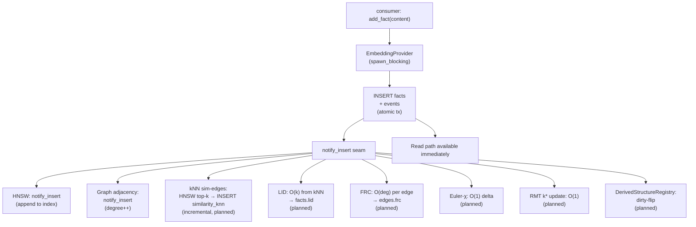
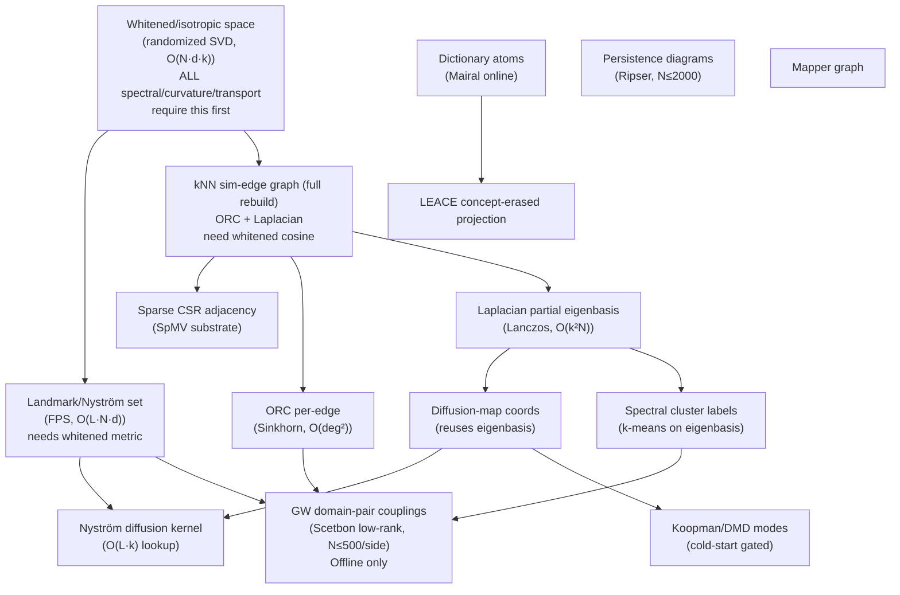
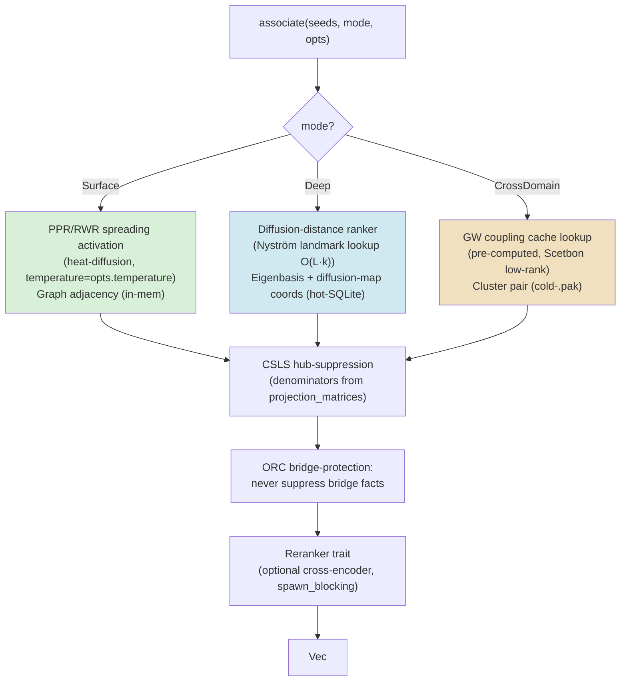
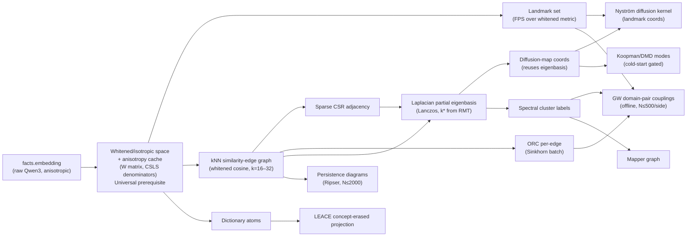

# Associative Recall & Cross-Domain Transfer — Architecture

> **Status: Designed, partially implemented.** The storage and reconstruction seams are in place. The derived operator structures (whitened space, similarity-edge graph, curvature, diffusion, GW) are planned for the geometric-associative-memory epic. This document describes the target architecture; structures marked _planned_ do not yet exist in the codebase.

The associative-recall subsystem enriches the engine's current pointwise-metric retrieval (FTS5 + cosine + Reciprocal Rank Fusion) with three additional operator families — diffusion geometry, graph curvature, and optimal transport — to support two capabilities the current stack provably cannot deliver:

- **F1 associative recall**: multi-hop, noise-robust retrieval that follows semantic chains rather than single nearest-neighbor steps.
- **F2 cross-domain transfer**: structural matching across memory regions that share no coordinate frame (e.g. recognising that compiler pass-ordering and recipe sequencing are analogous, even though their surface embeddings are dissimilar).

The design rests on the grounded operator survey in `34-geometric-memory-operator-taxonomy.md` and the data-structure inventory in `35-memory-data-structure-landscape.md`. Every operator referenced below is either `use-now` (verified, proven-transferable) or `worth-exploring` (verified math, one PoC away from adoption).

---

## 1. Where each structure lives

### 1.1 Terminology

| Tier | Meaning |
|------|---------|
| **Hot SQLite** | Columns/tables in the live `.sqlite` file; read from every query |
| **In-mem cache** | Rebuilt from the DB at startup or on demand; lost on restart |
| **Cold `.pak`** | Offline archive files; loaded only during dream-cycle passes |

### 1.2 Structure map

| Structure | Tier | Schema home | When built | Freshness class |
|-----------|------|-------------|------------|-----------------|
| `facts.embedding` (active Qwen3 vectors) | Hot SQLite | `facts` table | Ingest | Real-time |
| `fact_vectors` (non-active staging) | Hot SQLite | `fact_vectors` table | Reconstruction | Batch |
| `embedding_spaces` registry | Hot SQLite | `embedding_spaces` table | Promote tx | Real-time |
| `facts_fts` (FTS5 BM25 index) | Hot SQLite | Virtual table | Ingest (trigger) | Real-time |
| `edges` (typed + weighted, bi-temporal) | Hot SQLite | `edges` table | Ingest / consolidation | Real-time |
| `facts.lid` — Local Intrinsic Dimensionality | Hot SQLite | Column on `facts` _(planned)_ | Ingest (HNSW kNN reuse) | Incremental-on-ingest |
| `edges.frc` — Forman-Ricci curvature | Hot SQLite | Column on `edges` _(planned)_ | Ingest (degree + triangle) | Incremental-on-ingest |
| Hawkes intensity state (μ, last_t, R) | Hot SQLite | Sidecar table or columns _(planned)_ | Read call-site | Real-time async |
| `DerivedStructureRegistry` rows | Hot SQLite | Sidecar table _(planned)_ | On-demand | Invalidated-on-write |
| `config` row `space_epoch` (u64) | Hot SQLite | `config` K/V | Promote tx (inside) | Invalidated-on-write |
| Anisotropy-correction matrix W + CSLS denominators | Hot SQLite | `projection_matrices` table _(planned)_ | Dream-cycle | Batch-recompute |
| kNN similarity-edge graph | Hot SQLite | Extend `edges` (relation=`similarity_knn`) _(planned)_ | Ingest (HNSW-driven) | Incremental-on-ingest; wholesale rebuild on model swap |
| ORC per-edge (Ollivier-Ricci curvature) | Hot SQLite | Column on `edges` _(planned)_ | Dream-cycle | Batch |
| Spectral cluster labels `facts.cluster_id` | Hot SQLite | Column on `facts` _(planned)_ | Dream-cycle | Batch |
| Dictionary atoms D + sparse codes X | Hot SQLite + in-mem | Sidecar tables _(planned)_ | Dream-cycle | Incremental (Mairal online) |
| HNSW index | In-mem cache | Rebuilt from `facts.embedding` | Open / rebuild | Fenced on different-dim promote (#742) |
| Graph adjacency + degree | In-mem cache | Rebuilt from `edges` | Open / notify | Incremental-on-ingest |
| RMT k* scalars (N, d, γ, λ₊, τ*, k*) | In-mem cache | ~60 B scalars _(planned)_ | Ingest (O(1) update) | Incremental-on-ingest |
| Sparse CSR/CSC adjacency | In-mem cache _(planned)_ | Rebuilt from sim-edge graph | Dream-cycle | Batch |
| Laplacian + partial eigenbasis (U_k, Λ_k) | In-mem cache / Hot SQLite _(planned)_ | Cached table at N ≤ 50k, else cold | Dream-cycle | Batch; delete+rebuild on epoch mismatch |
| Diffusion-map coordinates + Nyström kernel | Hot SQLite _(planned)_ | Registered space at d' ≈ 64–256 | Dream-cycle | Batch (transitive on eigenbasis) |
| Landmark/Nyström set | Hot SQLite _(planned)_ | Sidecar table | Dream-cycle | Batch |
| Concept-erased projection (LEACE P) | Hot SQLite _(planned)_ | `projection_matrices` | Dream-cycle | Batch; rebuild on domain-distribution shift |
| GW domain-pair coupling cache | Cold `.pak` _(planned)_ | `.pak` + manifest row | Dream-cycle | Batch + TTL; invalidate on cluster shift |
| Persistence diagrams (H0/H1/H2) | Hot SQLite / cold scratch _(planned)_ | Diagram table | Dream-cycle | Batch |
| Mapper graph | Hot SQLite _(planned)_ | `mapper_nodes`/`mapper_edges` | Dream-cycle | Batch |
| Koopman/DMD mode buffer | Hot SQLite _(planned)_ | Sidecar table | Dream-cycle | Batch; cold-start gate T ≥ 2r+1 |

**Key constraint.** The store is append-only (soft-delete via `t_expired`). Every derived spectral or curvature structure is invalidated by each ingest. The `DerivedStructureRegistry` + `space_epoch` mechanism enforces a freshness contract: structures carry a content fingerprint `hash{epoch, W-version, k, scope-row-count-bucket}` and are re-dirtied when that fingerprint changes, not on epoch alone. This guards against the "looks fresh, is corrupt" failure where edge weights silently shift (e.g. whitening matrix W retuned without a model promote) without bumping the epoch counter.

---

## 2. Ingest hot path vs dream-cycle offline path

### 2.1 What is computed on each ingest event

The ingest hot path must remain sub-millisecond. Only O(1) or O(k) incremental operations are permitted inline. Everything else is dirty-flagged for the dream-cycle.



Hawkes intensity updates (`μ, last_t, R`) and access-event logging are intentionally **off the hot path**: they are batched as async fire-and-forget writes at the query call-site (the #96 access-count call-site), never inline on ingest or on individual result rows, to avoid holding SQLite's write lock across concurrent reads (Ozaki O(1)/event recursion; Hawkes 1971; Ozaki 1979).

### 2.2 What the dream-cycle computes offline

The dream-cycle is the batch cognitive pass. It claims dirty rows in the `DerivedStructureRegistry`, computes each structure under `spawn_blocking`, and flips the status to `fresh`. The dependency order is strict:



The dream-cycle exposes this pipeline through the existing `DreamCycle` trait; the `MaterializationScheduler` sub-step claims dirty rows, runs each phase, and flips them to `fresh`. Two mandatory startup consistency checks: re-dirty any row where `last_computed_at < MAX(facts.t_created)` (crash between commit and notify), and reset `status='dirty'` for any row stuck at `status='rebuilding'` (crash mid-build).

---

## 3. Reconstruction-seam interaction

The three reconstruction variants — same-dim (#623), different-dim (#742), and the planned full reindex (#624) — each invalidate derived structures in distinct ways.

### 3.1 Same-dimension reconstruction (#623)

A same-dim promote swaps `facts.embedding` in place with vectors from a new model at the **same** `embed_dim`. The HNSW index is rebuilt under write lock via `rebuild_from_db`. The `space_epoch` config row is bumped inside the promote transaction.

**Effect on derived structures:** All structures whose correctness depends on the whitening matrix W (i.e. every spectral, curvature, and transport structure) are invalidated by the epoch bump. The `DerivedStructureRegistry` re-dirties them. Ingest-tier scalars (LID, FRC, Hawkes) are reset to NULL and recomputed incrementally on subsequent ingests. The kNN similarity-edge graph is wholesale-deleted and rebuilt in the next dream-cycle (because cosine neighbourhoods change globally on model swap). The graph adjacency (typed edges) is not affected.

### 3.2 Different-dimension reconstruction (#742)

A different-dim promote fences the engine handle via `AtomicUsize reopen_required`. All 26 guarded methods (`ensure_open`) return an error until the consumer reopens at the new dimension D'. The HNSW index — whose `embed_dim` is immutable at open — is rebuilt at the new dimension on reopen.

**Effect on derived structures:** All embedding-derived structures are fully invalidated. The whitened/isotropic space (dim D) is meaningless at dim D' — the `projection_matrices` rows must be deleted and recomputed from scratch. The eigenbasis, diffusion-map coordinates, Nyström kernel, GW couplings, and all spectral structures (epoch-keyed) are deleted on epoch mismatch. The cost is equivalent to a fresh store for the geometric operator layer, absorbed into the reopen / next dream-cycle pass.

**RMT effective-rank guard.** Before committing the HNSW reindex at D' (inside `rebuild_from_db`), the engine computes the Marchenko-Pastur threshold λ₊ = σ²(1 + √γ)² where γ = D'/N, and the Gavish-Donoho optimal truncation threshold τ* <WARNING! missing provenance: the specific constant "2.858" in the original draft is attributed to Gavish-Donoho (2014), which is confirmed as a verified paper, but the exact constant cannot be confirmed from the bibliography entry alone — the formula should be verified against the primary source before asserting the coefficient>. If the effective rank k* = #{λ > λ₊} collapses toward 1 (the new space is degenerate — too few facts for the new dimension), the promote is refused. This directly hardens the #742 fence path. The scalars are O(1) given γ; the guard is free (Marchenko, Pastur 1967; Gavish, Donoho 2014; Baik, Ben Arous, Péché 2005).

### 3.3 Planned full reindex (#624)

#624 is a deferred in-place no-downtime dimension transition; it is not yet designed. Its effect on derived structures will be equivalent to a different-dim promote: full invalidation of the whitened space and all downstream caches, absorbed into the next dream-cycle.

### 3.4 Summary table

| Event | HNSW | Whitened space / W | kNN sim-edges | Laplacian / eigenbasis | GW couplings |
|-------|------|-------------------|---------------|----------------------|--------------|
| Ingest | notify_insert (append) | dirty-flag | +k INSERTs | dirty-flag | dirty-flag |
| Same-dim promote (#623) | rebuild_from_db | full-rebuild (epoch bump) | wholesale delete+rebuild | full-rebuild | full-rebuild |
| Different-dim promote (#742) | rebuild at D' | delete+rebuild at D' | delete+rebuild at D' | delete (epoch mismatch) | delete (epoch mismatch) |
| Dream-cycle consolidation | — | rebuild if dirty | optional full rebuild | dirty-flag-amortize | dirty-flag-amortize |
| Model swap without promote | (none) | **must dirty explicitly** | (none) | (none) | (none) |

The last row is the staleness hazard: if W or the sim-graph k is retuned without triggering a promote, the epoch counter does not increment. The content fingerprint in the `DerivedStructureRegistry` row (hash of `{epoch, W-version, k, scope-row-count-bucket}`) catches this; invalidation keys on fingerprint mismatch, not epoch alone.

---

## 4. Recall API surface

### 4.1 Planned `associate` entry point

The planned associative-recall API extends the existing `query_memory` surface with a structured `associate` call:

```rust
/// Mode-dispatched associative recall.
pub async fn associate(
    &self,
    seeds: &[FactId],         // starting facts (partial cue, concept node, or query result)
    mode:  AssociateMode,
    opts:  AssociateOptions,
) -> Result<Vec<ScoredFact>, MemoryError>;

pub enum AssociateMode {
    /// Surface recall: spreading activation from seeds via PPR/RWR.
    /// Uses the existing graph adjacency + similarity edges.
    /// Returns facts reachable within diffusion radius controlled by `opts.temperature`.
    Surface,

    /// Deep recall: diffusion-geometry ranker + optional Hopfield completion.
    /// Requires: whitened space + eigenbasis + diffusion-map coordinates.
    /// Falls back to Surface if derived structures are not yet materialized.
    Deep,

    /// Cross-domain transfer: GW structural matching from seed cluster to all other clusters.
    /// Requires: whitened space + spectral clusters + GW couplings.
    /// Offline-eligible only; returns empty if couplings are stale or absent.
    CrossDomain,
}

pub struct AssociateOptions {
    /// Diffusion temperature `t` for Surface/Deep modes (controls radius).
    pub temperature:     f64,
    /// Maximum facts to return.
    pub top_k:           usize,
    /// Scope filter (inherits from SearchQuery semantics).
    pub scope:           Option<ScopeId>,
    /// For CrossDomain: target cluster hint (None = all clusters).
    pub target_cluster:  Option<ClusterId>,
}
```

### 4.2 Surface vs Deep

**Surface recall** (`AssociateMode::Surface`) is the generalisation of the engine's current PPR/RWR spreading activation, reframed as a spectral low-pass heat-diffusion filter with an explicit temperature knob (Chung 2007; Gasteiger, Bojchevski, Günnemann 2019). It operates on the in-memory graph adjacency, is query-ephemeral (never cached), and is available immediately after ingest. It cannot cross the spectral gap between disconnected communities.

**Deep recall** (`AssociateMode::Deep`) replaces the cosine ranker with a diffusion-distance ranker (Coifman, Lafon, Lee, Maggioni, Nadler, Warner, Zucker 2005; Coifman, Lafon 2006). Diffusion distance is noise-robust — a single spurious kNN edge (an anisotropy artefact) does not collapse multi-hop reachability — and is computable in O(L·k) via the Nyström landmark approximation once the eigenbasis is materialized (Drineas, Mahoney 2005). It falls back to Surface if the derived structures are absent or stale.

**Cross-domain transfer** (`AssociateMode::CrossDomain`) uses the Gromov-Wasserstein coupling cache to find structurally analogous facts across memory regions with no shared coordinate frame (Mémoli 2011; Alvarez-Melis, Jaakkola 2018; Scetbon, Peyré, Cuturi 2022). GW matches two memory clusters by their **internal** distance matrices — it identifies pairs whose mutual distances are preserved, not pairs that are close in absolute coordinates. This is the principled mechanism for "compiler pass-ordering ≈ recipe sequencing" analogies that cosine spreading activation cannot reach. It is offline-eligible only: GW is NP-hard in the exact form; the practical path uses Scetbon low-rank couplings with a hard cap of N ≤ 500 facts per side (cluster size enforced via recursive split before forming any cost matrix). The mode returns empty when couplings are stale.

### 4.3 CSLS and hub-suppression

Regardless of mode, the final ranking step applies Cross-lingual Similarity Scaling (Conneau, Lample, Ranzato, Denoyer, Jégou 2018) to penalise hub facts — facts that appear in the top-k of many queries due to Qwen3's anisotropy (Ethayarajh 2019) rather than genuine relevance. CSLS denominators are batch-precomputed and stored in `projection_matrices`.

The Ollivier-Ricci curvature (ORC) score on each candidate's edges feeds a **topology-protected** recall refinement: facts that are the sole negative-curvature bridge between communities (most-negative ORC edges) are never suppressed, even when their absolute similarity score is low (Ollivier 2009; Ni, Lin, Luo, Gao 2019; Topping, Di Giovanni, Chamberlain, Dong, Bronstein 2022). Removing a bridge fact severs the cross-domain reachability that CrossDomain mode depends on.

---

## 5. Mermaid diagrams

### 5.1 Recall data-flow



Nodes in amber are offline-only (require dream-cycle materialization). Nodes in blue require at least one completed dream-cycle pass. Green nodes are available immediately.

### 5.2 Derived-structure freshness DAG

The whitened/isotropic space is the universal gate. All downstream structures are invalid before it is materialized and re-invalid after any model swap (Ethayarajh 2019). The DAG below maps the `→` dependency relation: if A → B, then B cannot be computed (or trusted) until A is `fresh` in the `DerivedStructureRegistry`.



### 5.3 Compute-tier partition

```mermaid
flowchart TB
    subgraph HOT ["REAL-TIME (sub-ms; hot-path safe)"]
        H1["HNSW notify_insert"]
        H2["Graph adjacency notify"]
        H3["kNN sim-edges +k INSERTs"]
        H4["LID per-node O(k)"]
        H5["FRC per-edge O(deg)"]
        H6["Euler-χ delta O(1)"]
        H7["RMT k* update O(1)"]
        H8["DerivedStructureRegistry dirty-flip"]
        H9["PPR/RWR (query-ephemeral)"]
    end

    subgraph BLOCK ["BLOCKING (seconds; spawn_blocking / off-path)"]
        B1["Whitened space\n+ anisotropy cache\n(randomized SVD)"]
        B2["kNN sim-edge graph\nfull rebuild (model swap)"]
        B3["ORC per-edge (Sinkhorn batch)"]
        B4["LEACE/INLP projection"]
        B5["Dictionary atoms batch init"]
        B6["Spectral cluster k-means\n(post-eigenbasis)"]
        B7["CSR adjacency build"]
    end

    subgraph LONG ["OFFLINE (minutes+; dream-cycle only)"]
        L1["Laplacian eigenbasis\n(Lanczos O(k²N))"]
        L2["Diffusion-map coords\n(reuses eigenbasis)"]
        L3["GW domain-pair couplings\n(Scetbon low-rank, N≤500/side)"]
        L4["Persistence diagrams\n(Ripser, N≤2000)"]
        L5["Mapper graph"]
        L6["Koopman/DMD fit\n(cold-start gated)"]
        L7["Tangent frames + VDM\n(cold-.pak patches only,\nintractable at full N)"]
    end

    HOT --> BLOCK
    BLOCK --> LONG
```



---

## 6. References

All citations are from the verified bibliography (`37-geometric-associative-memory-bibliography.md`, Sections I–IV).

- Amsaleg, Chelly, Furon, Girard, Houle, Kawarabayashi, Nett (2015). _Estimating Local Intrinsic Dimensionality._ KDD 2015.
- Alvarez-Melis, Jaakkola (2018). _Gromov-Wasserstein Alignment of Word Embedding Spaces._ EMNLP 2018.
- Baik, Ben Arous, Péché (2005). _Phase transition of the largest eigenvalue for nonnull complex sample covariance matrices._ Ann. Probab.
- Chung (2007). _The Heat Kernel as the PageRank of a Graph._ PNAS 104(50).
- Coifman, Lafon, Lee, Maggioni, Nadler, Warner, Zucker (2005). _Geometric Diffusions / Diffusion Maps._ PNAS 102(21).
- Coifman, Lafon (2006). _Diffusion Maps._ Appl. Comput. Harmon. Anal. 21.
- Conneau, Lample, Ranzato, Denoyer, Jégou (2018). _Word Translation Without Parallel Data (CSLS)._ ICLR 2018.
- Drineas, Mahoney (2005). _On the Nystrom Method for Approximating a Gram Matrix._ JMLR 6.
- Ethayarajh (2019). _How Contextual are Contextualized Word Representations?_ EMNLP-IJCNLP 2019.
- Gavish, Donoho (2014). _The optimal hard threshold for singular values is 4/sqrt(3)._ IEEE Trans. Inf. Theory 60(8).
- Gasteiger (Klicpera), Bojchevski, Günnemann (2019). _APPNP: Predict then Propagate._ ICLR 2019.
- Hawkes (1971). _Spectra of some self-exciting and mutually exciting point processes._ Biometrika 58(1).
- Houle (2017). _Local Intrinsic Dimensionality I._ SISAP 2017.
- Marchenko, Pastur (1967). _Distribution of eigenvalues for some sets of random matrices._ Mat. Sb. 72.
- Mémoli (2011). _Gromov-Wasserstein Distances and the Metric Approach to Object Matching._ Found. Comput. Math. 11(4).
- Ni, Lin, Luo, Gao (2019). _Community Detection on Networks with Ricci Flow._ Sci. Rep. 9:9984.
- Ollivier (2009). _Ricci Curvature of Markov Chains on Metric Spaces._ J. Funct. Anal. 256(3).
- Ozaki (1979). _Maximum likelihood estimation of Hawkes' self-exciting point processes._ Ann. Inst. Statist. Math. 31(1).
- Scetbon, Peyré, Cuturi (2022). _Linear-Time Gromov-Wasserstein via Low-Rank Couplings._ ICML 2022.
- Topping, Di Giovanni, Chamberlain, Dong, Bronstein (2022). _Understanding Over-squashing and Bottlenecks on Graphs via Curvature._ ICLR 2022.
