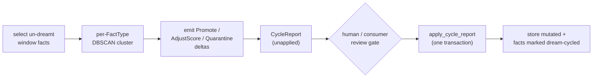

# Dream Cycle (Phase 5a)

The **dream cycle** is the Memory layer's batch cognitive pass: it consolidates
accumulated experience into wisdom, rescore facts from outcome feedback, and removes
contradicted facts from retrieval. It is the DreamCycle / PGO analogue of the
four-layer architecture.

This page documents the **R7/R8** design that shipped in #49: the delta-based report,
retrieve-before-reflect context, the transactional applier, and the default DBSCAN
implementation. For the rationale and research basis, see
[ADR 0014](../design/adr/0014-delta-based-cycle-report.md).

## Produce, then apply

A `DreamCycle` does **not** mutate the store. `run` _proposes_ a `CycleReport` — an
ordered log of typed deltas — and the engine _applies_ it in one transaction:

`run_dream_cycle` returns the unapplied report; the caller inspects it and calls
`apply_cycle_report`. This split is what lets a consumer gate promotion on review.

**Exposed via MCP.** The `memory_dream_cycle`, `memory_apply_cycle_report`, and
`memory_get_recent_insights` tools surface this pipeline over the Model Context
Protocol. `memory_dream_cycle` carries an `apply` flag (default `true`) that
collapses produce-and-apply into one call for the daily-hook ergonomic, while
`apply:false` preserves the review gate by returning the report for a later
`memory_apply_cycle_report`. See
[MCP Server → Cognitive Pipeline](../reference/mcp-server.md#cognitive-pipeline-memory_dream_cycle-memory_apply_cycle_report-memory_get_recent_insights).

## Caller-write deferral (#209)

When the harness fires fact-writes and the cycle on the **same trigger** (the #554
Ollama→ME swap runs both on SessionStart), running the cycle concurrently with the
caller's own writes is a race — and redundant, since the caller is actively curating
memory. `run_dream_cycle_guarded` is the gate:

- It keeps a persisted **fact-id high-water-mark cursor** (`last_caller_write_fact_id`)
  — the highest `facts.id` of a _caller-written_ fact seen at the last decision.
  "Caller-written" excludes pinned wisdom and dream-marked facts, so the cycle never
  trips on its own output.
- On entry it compares `max_caller_written_fact_id()` to the cursor. **New caller
  writes** (`max > cursor`) → advance the cursor and return
  `CycleOutcome::Skipped(SkipReason::CallerWroteFacts { .. })`; the facts stay
  un-dream-cycled for a later quiet run (**defer, not drop**). **No new writes** →
  delegate to `run_dream_cycle` and return `CycleOutcome::Ran(report)`. Steady state:
  each new caller-write batch causes exactly one skip, then a run.
- A skip touches **only** the cursor — never `last_dream_cycle_at` or the cycle
  history. The cursor advances only on skip; a real run relies on the `dream_cycle`
  marker (invariant M below) to drop processed facts from the signal.

**Invariant M** — _every fact a cycle creates or leaves active is dream-marked in the
apply transaction_: `apply_cycle_report` stamps `processed_ids ∪ new_fact_ids ∪
promoted_fact_ids ∪ supersede_new_ids`, not just the inputs. Without it the cycle's
own `AddFact` synthetics / promoted wisdom / Supersede survivors would read as fresh
caller writes (and re-enter the next cycle's input — a latent double-processing bug
this also closes). A `DreamCycle` impl must place **all** selected facts in
`processed_ids` (enforced: a report with `facts_selected > 0` and empty `processed_ids`
is rejected as `CycleError::MalformedReport`).

This is **deferral, not mutual exclusion** — concurrent guarded calls can both run
(idempotent via the marker + watermark); true locking is #207.

### Guarded vs unguarded entry points

| Method                    | Returns        | Use                                                     |
| ------------------------- | -------------- | ------------------------------------------------------- |
| `run_dream_cycle`         | `CycleReport`  | Unconditional produce (tests, force-a-run).             |
| `run_dream_cycle_guarded` | `CycleOutcome` | The harness/MCP entry — defers on caller writes (#209). |

`memory_dream_cycle` (MCP) uses the **guarded** path: a skip returns
`{ "did_run": false, "skipped": { "CallerWroteFacts": { .. } } }`; a run returns
`{ "did_run": true, "report": .., "did_apply": .. }`.

## The delta vocabulary

| Delta                                 | Effect on apply                                                                                                                                                                                                                                                                                                                                                           |
| ------------------------------------- | ------------------------------------------------------------------------------------------------------------------------------------------------------------------------------------------------------------------------------------------------------------------------------------------------------------------------------------------------------------------------- |
| `AddFact(NewFact)`                    | Insert a derived fact.                                                                                                                                                                                                                                                                                                                                                    |
| `AdjustScore { fact_id, adjustment }` | `importance += adjustment * IMPORTANCE_STEP`, clamped `[0,1]` (±2 quanta/cycle, cumulative). Targets the **base** `importance`, not the decayed `importance_score`.                                                                                                                                                                                                       |
| `Quarantine { fact_id, reason }`      | Soft-expire (`t_expired`) + a `quarantine` metadata marker. Removed from retrieval, kept for mining; reported as `ExpiredReason::Quarantined`.                                                                                                                                                                                                                            |
| `Promote { fact_id, provenance }`     | Create a pinned wisdom fact + lineage, reusing the promotion pipeline.                                                                                                                                                                                                                                                                                                    |
| `TagOutcome { fact_id, outcome }`     | Append an `OutcomeSignal` event.                                                                                                                                                                                                                                                                                                                                          |
| `Supersede { old_id, new_id }`        | Expire `old_id` + a `"supersedes"` graph edge `new_id → old_id`. Both facts must pre-exist.                                                                                                                                                                                                                                                                               |
| `Synthesize { sources, new_fact }`    | Atomically merge: insert `new_fact`, then for **each** source expire it + a `"supersedes"` edge `new_fact → source`, plus one `lineage` row. Sources must be non-empty + active. The merge primitive an LLM backend emits (it cannot be `AddFact + Supersede` — the synthetic's id is not knowable until insert — nor `AddFact + Quarantine`, which orphans the lineage). |

`apply_cycle_report` validates the whole report against a pre-apply snapshot, then
applies every delta in a single transaction — a malformed delta leaves the store
byte-identical. It also stamps each `processed_id` with the dream-cycled marker and
advances the `last_dream_cycle_at` watermark to the window end, so a sequential re-run
is a near no-op (idempotency). Concurrent double-fires are _not_ idempotent — mutual
exclusion is #207 (distributed lock) / #209.

## Retrieve-before-reflect: `CycleContext`

`DreamCycle::run` receives a `CycleContext` that wraps the capability bag
(`ctx.dream()` → query / consolidate / promote / `list_undreamt_in_period` /
`outcome_counts`) and adds the retrieved prior state:

- `prior_wisdom()` — active pinned wisdom facts (avoid re-deriving promoted patterns);
- `prior_reports()` — recent `CycleMetadata` (a bounded config-backed history);
- `time_window()` — the `[last_dream_cycle_at, now)` window to process.

## The default implementation

`DefaultDreamCycle` is the shipped, pure-Rust, deterministic cycle:

1. **Select** un-dream-cycled facts in the window.
2. **Cluster** per `FactType` with DBSCAN over embeddings (cosine distance, `eps=0.15`,
   `min_pts=3`). A cluster whose highest-importance member clears the per-type **P75**
   importance threshold yields a `Promote`.
3. **Rescore** from outcome history: net `positive − negative` (clamped to ±2) becomes
   an `AdjustScore`; a fact with a strong consistently-negative signal is `Quarantine`d.

It makes no LLM call and never writes, so it is immune to context collapse by
construction — the delta vocabulary's collapse-resistance is for _consumer_ LLM
implementations. Consolidation (the 3-pass `consolidate()`) is **not** run inside the
cycle (it mutates the store, which would break the producer's purity); schedule it as a
separate operator step. Identity computation (ANCHORS/CORE/PREDICTIONS) is #57; abstract
pattern extraction (R9), hierarchical composition (R13), and content-based correction
detection are #578.

## Pluggable backends: `LlmDreamCycle` (#554)

The consolidation backend is **pluggable and opt-in**. Because `run_dream_cycle_guarded`
takes `&dyn DreamCycle`, "which backend" is simply "which `DreamCycle` implementation" —
no core signature changes. The shipped `DefaultDreamCycle` (above) decides deterministically
in pure Rust; `LlmDreamCycle` delegates the _what to merge_ decision to an LLM.

`LlmDreamCycle` holds two injected consumer traits and keeps the engine LLM-free:

- a **`DeltaProposer`** — `propose(window, prior_wisdom) -> ConsolidationProposal`, returning
  merge groups (`source_ids` + `summary` text) and **nothing else**: it does not embed and
  does not touch the store. The HTTP implementation (`memory-engine-embed`'s
  `HttpDeltaProposer`) drives Ollama `/api/generate` in JSON mode at temperature 0.
- an **`EmbeddingProvider`** — the backend embeds its own summary text, so the engine never
  embeds on a backend's behalf (`apply_cycle_report` validates the embedding's dimension but
  does not compute it).

`run` then mirrors `DefaultDreamCycle`'s loop — select the undreamt window, decide, emit a
delta `CycleReport` — turning each merge group into a `Synthesize` delta. Three rails make an
untrusted proposer safe:

1. **Window clamp.** Every proposed `source_id` is filtered to the ids actually in the fed
   window (`validate_report` checks existence/active but _not_ window membership), so an LLM
   cannot act on facts it was never shown. A group left with no in-window source is dropped.
2. **`processed_ids` = the whole window**, never the proposer's output, so a forgetful
   proposer cannot leave a fact un-dream-marked and livelock the #209 guard.
3. **Apply-time validation.** Each `Synthesize` still clears `validate_report` and applies in
   the one all-or-nothing transaction.

A merge inherits the **max importance** of its sources, so consolidating high-value facts does
not yield a trivially-forgettable summary. The CLI `consolidate --backend {dream-cycle|llm}`
subcommand wires either backend end-to-end (see the [CLI reference](../reference/cli-inspector.md)).

See also: [consolidation pipeline](consolidation.md), [bi-temporal semantics](bi-temporal-semantics.md).
