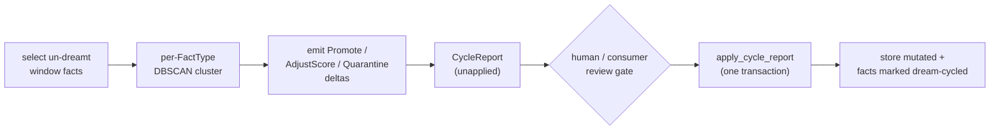

# Dream Cycle (Phase 5a)

The **dream cycle** is the Memory layer's batch cognitive pass: it consolidates
accumulated experience into wisdom, rescore facts from outcome feedback, and removes
contradicted facts from retrieval. It is the DreamCycle / PGO analogue of the
four-layer architecture.

This page documents the **R7/R8** design that shipped in #49: the delta-based report,
retrieve-before-reflect context, the transactional applier, and the default DBSCAN
implementation. For the rationale and research basis, see
[ADR 0014](../design/adr/0014-delta-based-cycle-report.md).

## Produce, then apply

A `DreamCycle` does **not** mutate the store. `run` _proposes_ a `CycleReport` — an
ordered log of typed deltas — and the engine _applies_ it in one transaction:

`run_dream_cycle` returns the unapplied report; the caller inspects it and calls
`apply_cycle_report`. This split is what lets a consumer gate promotion on review.

## The delta vocabulary

| Delta                                 | Effect on apply                                                                                                                                                     |
| ------------------------------------- | ------------------------------------------------------------------------------------------------------------------------------------------------------------------- |
| `AddFact(NewFact)`                    | Insert a derived fact.                                                                                                                                              |
| `AdjustScore { fact_id, adjustment }` | `importance += adjustment * IMPORTANCE_STEP`, clamped `[0,1]` (±2 quanta/cycle, cumulative). Targets the **base** `importance`, not the decayed `importance_score`. |
| `Quarantine { fact_id, reason }`      | Soft-expire (`t_expired`) + a `quarantine` metadata marker. Removed from retrieval, kept for mining; reported as `ExpiredReason::Quarantined`.                      |
| `Promote { fact_id, provenance }`     | Create a pinned wisdom fact + lineage, reusing the promotion pipeline.                                                                                              |
| `TagOutcome { fact_id, outcome }`     | Append an `OutcomeSignal` event.                                                                                                                                    |
| `Supersede { old_id, new_id }`        | Expire `old_id` + a `"supersedes"` graph edge `new_id → old_id`. Both facts must pre-exist.                                                                         |

`apply_cycle_report` validates the whole report against a pre-apply snapshot, then
applies every delta in a single transaction — a malformed delta leaves the store
byte-identical. It also stamps each `processed_id` with the dream-cycled marker and
advances the `last_dream_cycle_at` watermark to the window end, so a sequential re-run
is a near no-op (idempotency). Concurrent double-fires are _not_ idempotent — mutual
exclusion is #207 (distributed lock) / #209.

## Retrieve-before-reflect: `CycleContext`

`DreamCycle::run` receives a `CycleContext` that wraps the capability bag
(`ctx.dream()` → query / consolidate / promote / `list_undreamt_in_period` /
`outcome_counts`) and adds the retrieved prior state:

- `prior_wisdom()` — active pinned wisdom facts (avoid re-deriving promoted patterns);
- `prior_reports()` — recent `CycleMetadata` (a bounded config-backed history);
- `time_window()` — the `[last_dream_cycle_at, now)` window to process.

## The default implementation

`DefaultDreamCycle` is the shipped, pure-Rust, deterministic cycle:

1. **Select** un-dream-cycled facts in the window.
2. **Cluster** per `FactType` with DBSCAN over embeddings (cosine distance, `eps=0.15`,
   `min_pts=3`). A cluster whose highest-importance member clears the per-type **P75**
   importance threshold yields a `Promote`.
3. **Rescore** from outcome history: net `positive − negative` (clamped to ±2) becomes
   an `AdjustScore`; a fact with a strong consistently-negative signal is `Quarantine`d.

It makes no LLM call and never writes, so it is immune to context collapse by
construction — the delta vocabulary's collapse-resistance is for _consumer_ LLM
implementations. Consolidation (the 3-pass `consolidate()`) is **not** run inside the
cycle (it mutates the store, which would break the producer's purity); schedule it as a
separate operator step. Identity computation (ANCHORS/CORE/PREDICTIONS) is #57; abstract
pattern extraction (R9), hierarchical composition (R13), and content-based correction
detection are #578.

See also: [consolidation pipeline](consolidation.md), [bi-temporal semantics](bi-temporal-semantics.md).
