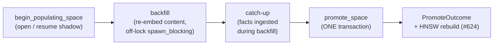

# Background Reconstruction

**Status: Implemented (same-dim) — #623**

Reconstruction re-embeds the stored fact **content** under a new embedding identity (a model
swap, e.g. a better same-dimension model or a re-quantization), in the background, then swaps the
new vectors in as the active serving vectors **atomically** — with no downtime and an instant
rollback. It is the only legitimate way to change a store's embedding identity (ADR 0015 §4): the
identity tuple and the vectors swap together, so retrieval is never served from a mixed vector
space.

Today's scope is **same-dimension**. A different-dimension swap (a new `embed_dim`) needs the
engine effective-dimension transition (pool / dim-validation / vector index at the new dim) and is
the [#742](https://github.com/dutiona/memory-engine/issues/742) follow-up; the storage layer here
is already dimension-agnostic.

## Why content is the source of truth

`facts.content` is the lossless original; `facts.embedding` is a derived projection of it under one
model. Because the content is retained, a model swap is a pure recomputation — re-embed every
`facts.content` under the new model and replace the derived vectors. No information is lost, and the
operation is repeatable and crash-safe.

## Storage model — `fact_vectors` holds the non-active spaces

Schema **v13→v14** adds one table:

```sql
CREATE TABLE fact_vectors (
    fact_id   INTEGER NOT NULL REFERENCES facts(id) ON DELETE CASCADE,
    space_id  TEXT    NOT NULL REFERENCES embedding_spaces(name) ON DELETE CASCADE,
    embedding BLOB    NOT NULL,
    PRIMARY KEY (fact_id, space_id)
) WITHOUT ROWID;
```

`fact_vectors` holds vectors for the **non-active** spaces only: the `populating` space during a
backfill, and the previous active space retained (as `deprecated`) after a promote for rollback.
The **active** space's vector stays in `facts.embedding` — exactly where it has always lived. So
there is exactly one source of truth for the served vector (no drift), and **every existing read
path is unchanged**: the `FACT_COLUMNS` query sites, the brute-force vector scan, HNSW, and dump
never touch `fact_vectors`. Only new reconstruction code reads it.

> **Design note — why not make `fact_vectors` the read source?** An earlier draft made
> `fact_vectors` the served store with an O(1) status-flip promote. The 5-lens plan review priced
> "repoint all reads" at 17 hot-path `FACT_COLUMNS` JOIN sites (`row_to_fact` has no DB handle) plus
> the migration blast radius — permanent complexity for a benefit that only matters on the _rare_
> promote. We keep `facts.embedding` active (zero read-path change) and pay an O(N) copy-swap on
> promote instead. Lower risk, smaller change, same future-proofing.

## Lifecycle



`MemoryEngine::reconstruct(new_fingerprint, embedder)` drives the cycle. The embedder stays
engine-side; the storage port methods are pure DB operations (the backend does no network/LLM
work). Embedding runs off the write lock under `spawn_blocking`, so a slow or `reqwest::blocking`
provider neither parks the runtime nor panics with a nested-runtime error (the #631 pattern).

### Backfill — resumable, crash-safe, idempotent

Each batch selects the next window of facts that still lack a vector in the populating space via a
**cursorless anti-join** (`facts LEFT JOIN fact_vectors … WHERE v.fact_id IS NULL AND f.id > :after
ORDER BY f.id LIMIT :n`), re-embeds the content, and writes the batch with `ON CONFLICT(fact_id,
space_id) DO NOTHING`. There is **no persisted cursor** — the absent `fact_vectors` row _is_ the
work signal — so:

- a **crash** mid-backfill loses at most one in-flight batch, re-derived on restart;
- a **concurrent insert** (live reconstruction) is picked up on the next pass (`facts.id` is
  monotonic, so a new fact always has a higher id and is never skipped);
- a **replay** is a no-op (the conflict clause).

Re-running `reconstruct` after a crash **resumes** the same populating space — `begin_populating` is
idempotent (it reopens an existing populating space with a matching fingerprint).

Backfill covers **every** fact, expired or not. The promote copy-swaps with a _total_ `UPDATE`, and
`facts.embedding` is `NOT NULL`; a fact missing a populating vector would either abort the swap or
split the active space across two identities. A homogeneous active space is the invariant;
re-embedding expired facts is the cheap price.

### Promote — one atomic transaction

The promote is a **single** `block_write` transaction, never decomposed (any `?` before `commit`
drops the transaction and rolls back, so a mid-promote failure cannot leave partial state):

0. **Same-dim guard** — `populating.dim == active.dim`, else error (different-dim → #742).
1. **Completeness gate _inside_ the tx** — every fact must already have a populating vector. This
   runs inside the transaction (not before it), so a straggler that lands after the catch-up pass
   is caught here rather than silently dropped (no TOCTOU).
2. **Retain** the old active vectors into `fact_vectors[old]` for rollback.
3. **Copy-swap** the populating vectors into `facts.embedding` (the O(N) swap).
4. **Demote-then-activate** the registry status (the partial-unique index never transiently sees two
   `active` rows). **This flip _is_ the identity swap** — `embedding_meta::load` reads the active
   row's fingerprint — so the served identity and the served vectors change together, atomically.
5. **Delete** the now-redundant `fact_vectors[populating]` rows.

The result is a `PromoteOutcome` (see [below](#promoteoutcome-and-index-rebuild)): the swapped-fact
count, the deprecated old space's name, the new active fingerprint (carrying the new dim for #742),
the straggler count, and `rebuild_index`.

## Single-active invariant

At most one `embedding_spaces` row is `active` at any time, enforced **structurally** by a partial
unique index (`UNIQUE(status) WHERE status = 'active'`) — it cannot be bypassed by any writer. The
promote's demote-then-activate ordering preserves it across the swap. A populating space coexists
because its status is `populating`, not `active`.

## Rollback

Because the promote **retains** the previous active vectors in `fact_vectors[old]` (keyed by the now -`deprecated` space), a rollback is the inverse copy-swap: retain the current vectors, load the old
ones back into `facts.embedding`, and flip the status. This is the mechanism #689 surfaces as
operator UX.

## (PromoteOutcome)

`rebuild_index` is always `true`: a promote changes every active vector, so a downstream vector
index (HNSW) must rebuild. The **live in-process rebuild is #624**; until then, a SQLite+`ann`
backend's index is stale only between the promote and the next open (which rebuilds it via
`build_from_db`). The brute-force vector path (default features) reads `facts.embedding` directly and
is correct immediately.

## Dump / restore

Dump and restore are **additive**. A snapshot gains a `fact_vectors` section (streamed row-by-row,
O(1) peak memory) so the non-active spaces survive a backup — which the #689 rollback UX relies on.
Restore writes them after `embedding_spaces` and `facts` (foreign-key order). A pre-#623 snapshot has
no `fact_vectors` field and defaults to empty; `facts[].embedding` is unchanged, so an old snapshot
loses nothing.

## Scope and dependencies

| Concern                                                | Where       |
| ------------------------------------------------------ | ----------- |
| Same-dim reconstruction (this page)                    | **#623** ✅ |
| Different-dim transition (new `embed_dim`)             | #742        |
| Live in-process HNSW / similarity-edge rebuild         | #624        |
| Live-write race during the promote window              | #625        |
| Operator UX (CLI/MCP) + query-across-spaces / rollback | #689        |

## See also

- {doc}`consolidation` — the other read → compute → write atomic pipeline.
- `docs/design/adr/0015-cross-layer-embedding-identity-policy.md` §4 — the cross-layer identity policy.
- `docs/design/schema-evolution-policy.md` — the v13→v14 migration (purely additive).
