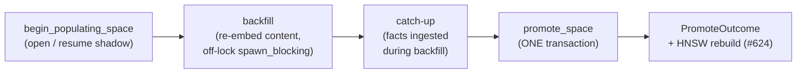

# Background Reconstruction

**Status: Implemented (same-dim) — #623**

Reconstruction re-embeds the stored fact **content** under a new embedding identity (a model
swap, e.g. a better same-dimension model or a re-quantization), in the background, then swaps the
new vectors in as the active serving vectors **atomically** — with no downtime and an instant
rollback. It is the only legitimate way to change a store's embedding identity (ADR 0015 §4): the
identity tuple and the vectors swap together, so retrieval is never served from a mixed vector
space.

Two flavors:

- **Same-dimension** (#623) — a model/quantization swap at the same `embed_dim`. Zero downtime:
  the engine keeps serving across the promote.
- **Different-dimension** (#742) — a swap to a new `embed_dim`. Also supported, but because the
  engine's `embed_dim` is consumer-passed and cached immutably at open, a different-dim promote
  cannot take effect on the live handle. The promote **fences** the handle, and the consumer
  **reopens the engine at the new dimension** (a brief downtime — see
  [Different-dimension reconstruction](#different-dimension-reconstruction-reopen-at-d) below). A
  truly in-place, no-reopen dimension transition is a separate, larger effort (it would need
  `embed_dim` interior-mutable across the engine + an in-place vector-index swap) and is deferred.

## Why content is the source of truth

`facts.content` is the lossless original; `facts.embedding` is a derived projection of it under one
model. Because the content is retained, a model swap is a pure recomputation — re-embed every
`facts.content` under the new model and replace the derived vectors. No information is lost, and the
operation is repeatable and crash-safe.

## Storage model — `fact_vectors` holds the non-active spaces

Schema **v13→v14** adds one table:

```sql
CREATE TABLE fact_vectors (
    fact_id   INTEGER NOT NULL REFERENCES facts(id) ON DELETE CASCADE,
    space_id  TEXT    NOT NULL REFERENCES embedding_spaces(name) ON DELETE CASCADE,
    embedding BLOB    NOT NULL,
    PRIMARY KEY (fact_id, space_id)
) WITHOUT ROWID;
```

`fact_vectors` holds vectors for the **non-active** spaces only: the `populating` space during a
backfill, and the previous active space retained (as `deprecated`) after a promote for rollback.
The **active** space's vector stays in `facts.embedding` — exactly where it has always lived. So
there is exactly one source of truth for the served vector (no drift), and **every existing read
path is unchanged**: the `FACT_COLUMNS` query sites, the brute-force vector scan, HNSW, and dump
never touch `fact_vectors`. Only new reconstruction code reads it.

> **Design note — why not make `fact_vectors` the read source?** An earlier draft made
> `fact_vectors` the served store with an O(1) status-flip promote. The 5-lens plan review priced
> "repoint all reads" at 17 hot-path `FACT_COLUMNS` JOIN sites (`row_to_fact` has no DB handle) plus
> the migration blast radius — permanent complexity for a benefit that only matters on the _rare_
> promote. We keep `facts.embedding` active (zero read-path change) and pay an O(N) copy-swap on
> promote instead. Lower risk, smaller change, same future-proofing.

## Lifecycle



`MemoryEngine::reconstruct(new_fingerprint, embedder)` drives the cycle. The embedder stays
engine-side; the storage port methods are pure DB operations (the backend does no network/LLM
work). Embedding runs off the write lock under `spawn_blocking`, so a slow or `reqwest::blocking`
provider neither parks the runtime nor panics with a nested-runtime error (the #631 pattern).

### Backfill — resumable, crash-safe, idempotent

Each batch selects the next window of facts that still lack a vector in the populating space via a
**cursorless anti-join** (`facts LEFT JOIN fact_vectors … WHERE v.fact_id IS NULL AND f.id > :after
ORDER BY f.id LIMIT :n`), re-embeds the content, and writes the batch with `ON CONFLICT(fact_id,
space_id) DO NOTHING`. There is **no persisted cursor** — the absent `fact_vectors` row _is_ the
work signal — so:

- a **crash** mid-backfill loses at most one in-flight batch, re-derived on restart;
- a **concurrent insert** (live reconstruction) is picked up on the next pass (`facts.id` is
  monotonic, so a new fact always has a higher id and is never skipped);
- a **replay** is a no-op (the conflict clause).

Re-running `reconstruct` after a crash **resumes** the same populating space — `begin_populating` is
idempotent (it reopens an existing populating space with a matching fingerprint).

Backfill covers **every** fact, expired or not. The promote copy-swaps with a _total_ `UPDATE`, and
`facts.embedding` is `NOT NULL`; a fact missing a populating vector would either abort the swap or
split the active space across two identities. A homogeneous active space is the invariant;
re-embedding expired facts is the cheap price.

### Promote — one atomic transaction

The promote is a **single** `block_write` transaction, never decomposed (any `?` before `commit`
drops the transaction and rolls back, so a mid-promote failure cannot leave partial state):

0. **Resolve** the active + populating spaces. No dim guard — a promote is dimension-agnostic at the
   storage layer (the copy-swap is a blob-level `UPDATE`), so `populating.dim` may differ from
   `active.dim` (#742). The width invariant is the engine-side per-vector backfill check; a
   different-dim promote fences the handle (below).
1. **Completeness gate _inside_ the tx** — every fact must already have a populating vector. This
   runs inside the transaction (not before it), so a straggler that lands after the catch-up pass
   is caught here rather than silently dropped (no TOCTOU).
2. **Retain** the old active vectors into `fact_vectors[old]` for rollback.
3. **Copy-swap** the populating vectors into `facts.embedding` (the O(N) swap).
4. **Demote-then-activate** the registry status (the partial-unique index never transiently sees two
   `active` rows). **This flip _is_ the identity swap** — `embedding_meta::load` reads the active
   row's fingerprint — so the served identity and the served vectors change together, atomically.
5. **Delete** the now-redundant `fact_vectors[populating]` rows.

The result is a `PromoteOutcome` (see [below](#promoteoutcome-and-index-rebuild)): the swapped-fact
count, the deprecated old space's name, the new active fingerprint (carrying the new dim for #742),
the straggler count, and `rebuild_index`.

## Single-active invariant

At most one `embedding_spaces` row is `active` at any time, enforced **structurally** by a partial
unique index (`UNIQUE(status) WHERE status = 'active'`) — it cannot be bypassed by any writer. The
promote's demote-then-activate ordering preserves it across the swap. A populating space coexists
because its status is `populating`, not `active`.

## Rollback

Because the promote **retains** the previous active vectors in `fact_vectors[old]` (keyed by the now -`deprecated` space), a rollback is the inverse copy-swap: retain the current vectors, load the old
ones back into `facts.embedding`, and flip the status. This is the mechanism #689 surfaces as
operator UX.

## Different-dimension reconstruction (reopen-at-D′)

A different-dimension reconstruction (a new `embed_dim`, D→D′) runs the same lifecycle — the storage
layer is dimension-agnostic — but the engine's `embed_dim` is consumer-passed and **frozen at open**,
threaded immutably into the connection pool, the vector index, and every `deserialize_embedding` read
site. So once the promote makes `facts.embedding` D′-wide, the live handle (still holding D) cannot
serve it.

The handle is therefore **fenced** at the promote: `MemoryEngine.reopen_required` is set to D′, and
every embedding-touching method returns `MemoryError::EmbeddingReopenRequired { new_dim }` (the push
channel) while `MemoryEngine::reopen_required()` reports `Some(D′)` (the pull channel). A read on a
fenced handle never deserializes a D′ blob at D — and even if a gated method were missed, the checked
`deserialize_embedding` returns a loud `EmbeddingDimension`, never silent corruption. The fence
upgrades that to an actionable error.

The consumer then **reopens at D′**:

```text
let outcome = engine.reconstruct(&new_fp /* dim D′ */, &embedder_at_Dprime).await?;
// engine.reopen_required() == Some(D′); embedding-touching reads now refuse.
engine.flush_snapshot().await?;                      // fenced → clean no-op (no stale-dim sidecar)
drop(engine);
let engine = MemoryEngine::open(EngineConfig::new(path, Dprime) …)?;  // validates clean, rebuilds @ D′
```

Reopen re-runs the open path: `validate_embed_dim_against_meta` passes because the active identity is
now D′, and the vector index is rebuilt at D′ from the freshly-promoted `facts.embedding` — so #624's
live in-process rebuild is **not** needed for the different-dim path (the reopen rebuilds for free).
The brief window between promote-commit and reopen is the accepted downtime; a truly in-place,
no-reopen transition (interior-mutable `embed_dim` + a live index swap) is deferred.

**In-memory engines** have no file to reopen, so a different-dim reconstruction leaves an in-memory
handle permanently fenced (build a fresh engine and re-ingest). **Crash recovery:** if a crash leaves
the DB promoted at D′ but the consumer reopens with the old-D config, the open is rejected with
`EmbedDimMismatch { stored: D′, requested: D }` — the consumer updates its config to D′ (no engine
self-heal, to avoid silent-identity-adoption, per #614).

## PromoteOutcome and index rebuild

`rebuild_index` is always `true`: a promote changes every active vector, so a live in-process vector
index (HNSW) must rebuild. The engine acts on this at the end of `reconstruct`:

- **Same-dim (#624):** the handle is not fenced and keeps serving, so `reconstruct` rebuilds the
  in-process index **in place before returning**, via `SearchIndex::rebuild_vector_index` (SQLite+`ann`
  does a full `build_from_db`-equivalent scan under the index's write lock; the swap is atomic, so a
  concurrent `vector_search` sees the whole old or whole new index). Queries reflect the new model
  immediately — no reopen needed.
- **Different-dim (#742):** the handle is fenced and the consumer reopens at `D′`, which rebuilds the
  index on open. `reconstruct` does **not** rebuild in place here (it would read the new `D′`-wide
  blobs at the old dimension → `EmbeddingDimension`).

The brute-force vector path (default features) reads `facts.embedding` directly, so it is correct the
instant the promote commits (same-dim) or on reopen (different-dim). Durability across reopen is
independent of the live rebuild: the engine snapshot reads vectors from the DB, so a `close()` after a
same-dim promote already persists the new vectors regardless.

### Similarity-edge invalidation (N/A in the Memory layer)

Issue #624 also framed this as "invalidate cached similarity graph edges — the analog of the Knowledge
layer deleting `relation_type = "similar"`." **The Memory layer persists no such edges, by design.**
Every graph edge is _semantic provenance_ — `co_session`, `supersedes`, `supplements`, `contradicts`
(session links and arbiter decisions) — which encodes real history and **must survive a model swap**;
deleting it would destroy lineage. Vector similarity is computed _transiently_ (query-time RRF fusion,
consolidation/DBSCAN clustering, on-the-fly resonance), never materialized as edges. The **only**
materialized embedding-similarity cache in the Memory layer is the HNSW proximity graph itself — so
"invalidate cached similarity edges" collapses to "rebuild the index": the same single action above,
not a second edge-deletion step. (The Knowledge layer's `DELETE relation_type = "similar"` has no
Memory-layer counterpart.)

A _persisted_ associative similarity-edge graph — for spreading-activation recall (a fast, high-decay
"surface recall" vs. a wide, low-decay "deep recall") — is a possible **future** cognitive-layer
feature. If it lands, its invalidate-and-recompute step slots in alongside the index rebuild at this
same reconstruction seam; the engine already documents the same-dim branch as the
"refresh embedding-derived caches" point.

## Dump / restore

Dump and restore are **additive**. A snapshot gains a `fact_vectors` section (streamed row-by-row,
O(1) peak memory) so the non-active spaces survive a backup — which the #689 rollback UX relies on.
Restore writes them after `embedding_spaces` and `facts` (foreign-key order). A pre-#623 snapshot has
no `fact_vectors` field and defaults to empty; `facts[].embedding` is unchanged, so an old snapshot
loses nothing.

After a **different-dimension** reconstruction (#742) the active space is D′ while a retained
`deprecated` space is still D-wide, so a single engine `embed_dim` cannot decode every row. The dump
therefore decodes each `fact_vectors` row at **its own space's recorded dimension** (read from
`embedding_spaces`), and restore re-serializes dimension-agnostically — so a reconstructed store
round-trips with its deprecated rollback vectors intact, no data loss.

## Scope and dependencies

| Concern                                                      | Where       |
| ------------------------------------------------------------ | ----------- |
| Same-dim reconstruction                                      | **#623** ✅ |
| Different-dim transition (new `embed_dim`, via reopen-at-D′) | **#742** ✅ |
| In-place (no-reopen) live dimension transition               | deferred    |
| Live in-process HNSW / similarity-edge rebuild (same-dim)    | #624        |
| Live-write race during the promote window                    | #625        |
| Operator UX (CLI/MCP) + query-across-spaces / rollback       | #689        |

## See also

- {doc}`consolidation` — the other read → compute → write atomic pipeline.
- `docs/design/adr/0015-cross-layer-embedding-identity-policy.md` §4 — the cross-layer identity policy.
- `docs/design/schema-evolution-policy.md` — the v13→v14 migration (purely additive).
