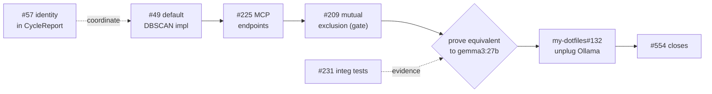

# Epic #554: Replace Ollama Interim Consolidator with ME `dream_cycle` / `get_recent_insights`

**Epic:** #554 (this repo) — terminal leaf `dutiona/my-dotfiles#132`
**Blocked by:** #567 (epic: path to Phase 5a fully featured)
**Branch:** `docs-554-ollama-swap-sequencing` (worktree)
**Scope gate (decided):** Minimal + #209 — see [Scope Decision](#scope-decision)

---

## Context

Ownership-map system #2 ("Ollama consolidation") is an **interim** owner of Memory-layer
consolidation: the harness shells out to `memory-consolidate.sh`, which calls `gemma3:27b`
at `localhost:11434`. The four-layer thesis assigns consolidation to the Memory layer (ME):
`dream_cycle` is the DreamCycle / PGO analogue. Epic #554 tracks unplugging Ollama once ME
exposes a native, proven-equivalent pipeline.

This document is the **cross-issue sequencing plan** to reach #554. It is not a single-PR
implementation plan — it sequences the issues under #567 (the binding blocker) into landing
waves, identifies the true critical path, and records the scope decision.

### Verified state (as of 2026-06-16)

The scaffolding for the cognitive pipeline is in place; the **default implementation and its
MCP surface are not**. Concretely, in `src/`:

- `DreamCycle` trait — `src/traits.rs:189` — `run(&DreamContext) -> Result<CycleReport>`.
- `DreamContext` — `src/engine/cognitive.rs:32` — capability bag handed to a cycle:
  `query` / `list_active_facts` / `get_fact` / `consolidate` / `forget` / `promote` /
  `record_insight`.
- `MemoryEngine::run_dream_cycle(&dyn DreamCycle)` — `src/engine/cognitive.rs:139` — the
  engine can *run* a cycle but ships **no concrete cycle**; the only `impl DreamCycle` in the
  tree is a test-only `NoopCycle` (`src/engine/cognitive.rs:274`).
- **No MCP tools** `dream_cycle` / `get_recent_insights` exist yet in `memory-engine-mcp/`.

So the gap is exactly #49 (default impl) → #225 (MCP surface).

---

## Dependency state

All states verified against GitHub on 2026-06-16 (not the possibly-stale epic-body tally).

| Issue | State | Role | Blockers (verified) |
| ----- | ----- | ---- | ------------------- |
| **#49** DreamCycle default DBSCAN impl | OPEN | **Linchpin** | #47 ✅ #43 ✅ → **ready now** |
| **#57** Three-layer identity in `CycleReport` | OPEN | #567 exit | touches `CycleReport` (coordinate w/ #49) |
| **#225** MCP endpoints (`dream_cycle`, `get_recent_insights`) | OPEN | **#554's binding prereq** | #49 ✗; #48 ✅ #55 ✅ #63 ✅ |
| **#231** Phase-5a integration tests | OPEN | #567 exit | wants #49 + #225 |
| #160 `importance_rationale` on `Fact` | OPEN | hardening / transparency | alongside #49 |
| #161 adversarial self-review promotion gate | OPEN | hardening | alongside #49 |
| #207 distributed lock (mtime+PID, 1h staleness) | OPEN | hardening | alongside #49 |
| #208 circuit breaker (3× consecutive failures) | OPEN | hardening | alongside #49 |
| #209 skip if caller already wrote facts | OPEN | **hardening — promoted to gate** | alongside #49 |
| #227 plan-archive doc | OPEN | doc | none |
| #567 epic (Phase 5a MVP) | OPEN | **blocks #554** | exit = #49 + #57 + #225 + #231 |
| `my-dotfiles#132` harness re-wire | (other repo) | **#554 terminal leaf** | #225 endpoints must exist |
| **#554** epic | OPEN | target | blocked-by #567 |

Closed prerequisites that unblock the chain: #47 (wisdom-promotion API), #43 (session-log
bootstrap), #48 (hook-based capture), #55 (provenance), #56 (DreamCycleConfig), #63 (outcome
tracking).

---

## Critical path

The path to #554 is a four-link serial chain. Everything else under #567 is quality-gating
*around* it, not *on* it.

`#49 → #225 → #209 → prove-equivalent → my-dotfiles#132 → #554`.

---

## Scope decision

**Chosen: Minimal + #209.**

#554's own blocking comment states its binding prerequisite is "#567's exit (#49 default impl
+ #225 MCP endpoints)" — the **#49 + #225 subset**, not all eleven children of #567. The strict
minimal path is therefore `#49 → #225 → prove → #132`.

We add **one** hardening issue as a hard gate before the harness re-wire:

- **#209 (skip if caller already wrote facts)** — the live harness writes facts on the same
  SessionStart trigger that fires `dream_cycle`. Without mutual exclusion, the cycle can
  consolidate over a corpus the caller is concurrently mutating. This is the one race the swap
  *introduces*, so it gates Wave 3.

#57, #231, #207, #208, #160, #161 remain #567 exit criteria but may close **after** #554. The
full #567 epic does not block the swap under this decision; only the #49 + #225 + #209 subset
does.

---

## Landing waves

### Wave 1 — make the pipeline runnable (linchpin)

- **#49 — default DBSCAN `DreamCycle` impl.** Start here; unblocked. Pipeline per the issue:
  select time window of unconsolidated memories → run existing 3-pass `consolidate()`
  (dedup → cluster → global) → DBSCAN pattern detection for wisdom-promotion candidates →
  human review gate before promotion → mark processed memories "dream-cycled" to avoid
  re-processing. Returns `CycleReport`.
- **#57 — three-layer identity output** (ANCHORS / CORE / PREDICTIONS) folded into
  `CycleReport` **in the same wave as #49.** Both mutate `CycleReport`; sequencing them
  together avoids a second struct churn — and, downstream, a second MCP-schema churn.
- **#160 / #161** land alongside: `importance_rationale` on `Fact` and the adversarial
  self-review ("Wait a minute") promotion gate both hook into the promotion path #49 builds.

### Wave 2 — expose + harden

- **#225 — MCP endpoints.** Wrap the Wave-1 impl as `dream_cycle` (returns `CycleReport`) and
  `get_recent_insights(project_path, limit?)`. This is the literal exit #554 waits on.
- **#209 — mutual exclusion (gate).** Skip the cycle when the caller already wrote facts this
  session. **Hard gate for Wave 3.**
- **#207 / #208 — operational safety** for the unattended daily SessionStart trigger:
  distributed lock (mtime+PID, 1h staleness, rollback) and circuit breaker (3× consecutive
  failures → stop). Recommended before going live, not strictly gating under the scope
  decision.
- **#231 — integration tests** covering both endpoints. A #567 exit criterion and the
  evidence base for "prove equivalent" below.

### Wave 3 — the swap (this is #554 proper)

1. **Prove equivalent.** Run ME `dream_cycle` over the same corpus the Ollama `gemma3:27b`
   consolidator processes; compare consolidation + promotion output. Methodology below.
2. **`my-dotfiles#132`.** Re-wire the harness off `memory-consolidate.sh` / `localhost:11434`
   onto the native MCP `dream_cycle` endpoint. Interim Ollama stays live until this merges.
3. **#554 closes** once #132 is merged and Ollama is unplugged.

---

## "Prove equivalent" methodology

The swap replaces an LLM consolidator (`gemma3:27b`) with a deterministic DBSCAN pipeline.
"Equivalent" cannot mean byte-identical output. Proposed acceptance basis:

- **Corpus parity** — feed both consolidators the same historical fact/event window.
- **Dedup/prune parity** — ME's 3-pass consolidation should retire a comparable set of
  duplicate/stale facts (compare retired-fact sets; expect ≥ overlap threshold, document
  divergence).
- **Promotion sanity** — patterns ME flags for wisdom promotion should be a reasonable
  superset/subset of what the Ollama path surfaced; human review gate (#49) catches the
  delta.
- **No regression in `get_recent_insights`** — the harness's insight-retrieval needs are met
  by the native endpoint.
- **Captured in #231** plus a one-off comparison harness; the result is the evidence attached
  to #554 / `my-dotfiles#132` before unplugging Ollama.

---

## Risks & notes

- **CycleReport churn** — #49 and #57 both shape `CycleReport`. Landing them apart forces a
  second public-struct change and a second MCP-schema revision. Wave 1 couples them on purpose.
- **Workspace verification gate** — #225 touches the MCP crate's public surface; per
  `CLAUDE.md`, run `cargo build/test/clippy --workspace` (not just the root crate) for #49,
  #225, and anything touching `types.rs` / `traits.rs`.
- **Cross-repo terminal leaf** — #554 cannot fully close from this repo; `my-dotfiles#132` is
  the merge that retires Ollama. Track it as the closing action.
- **Interim stays live** — do not remove `memory-consolidate.sh` or the Ollama dependency
  until #132 merges with passing equivalence evidence.
